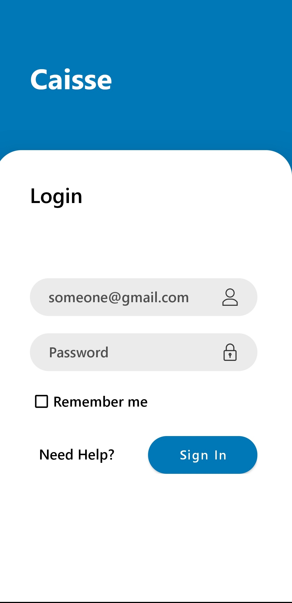
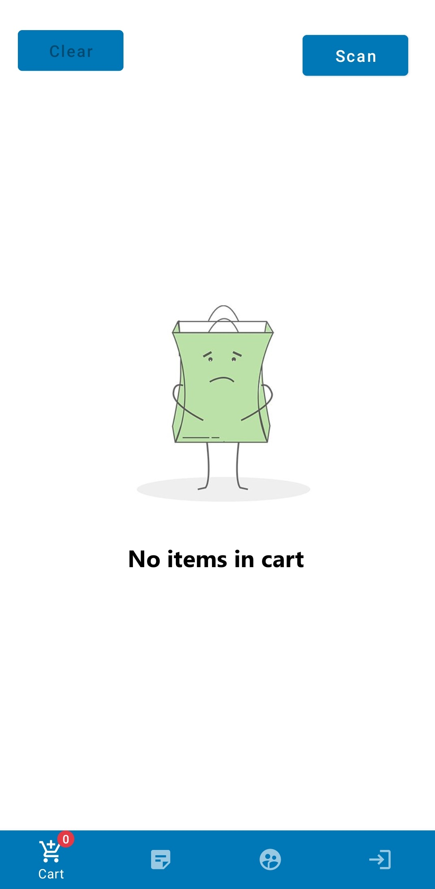
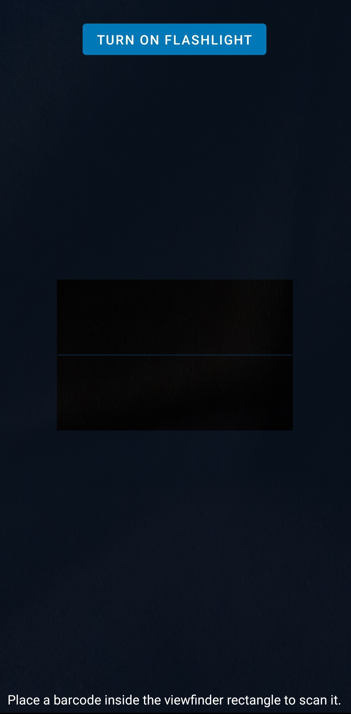
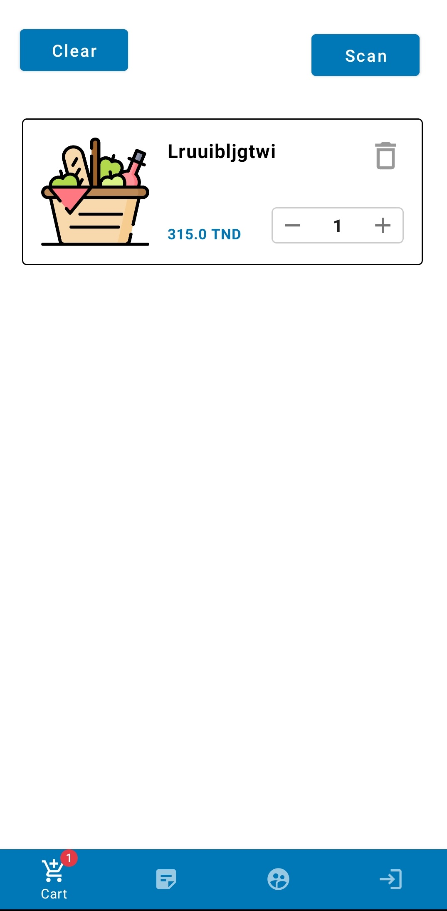
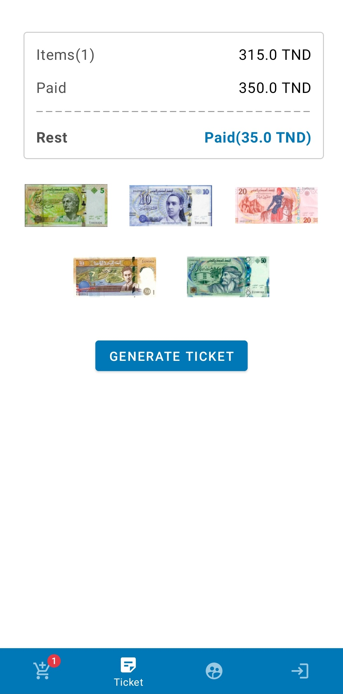
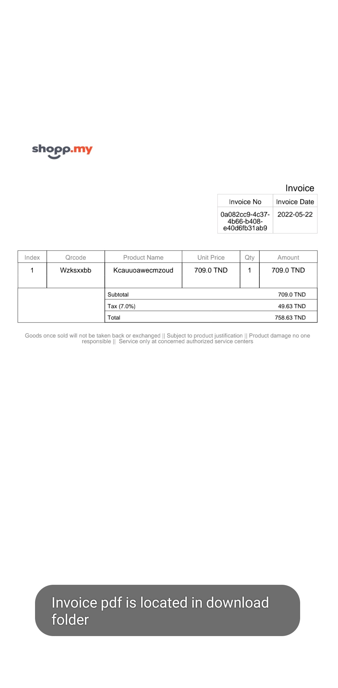
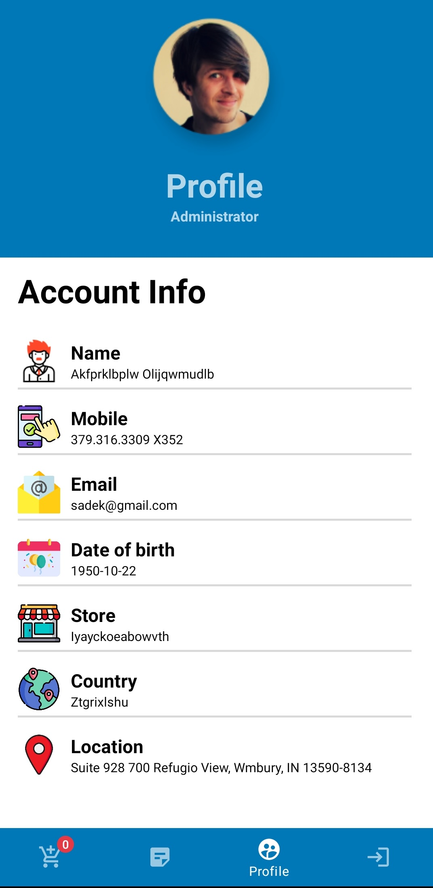
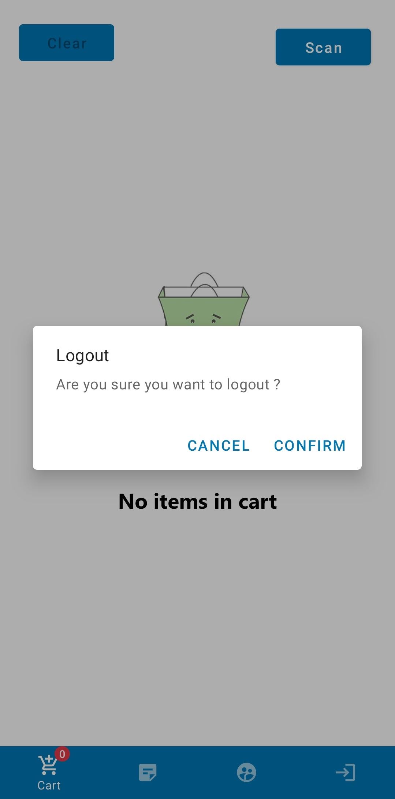

<div id="top"></div>

<br />
<div align="center">
<h3 align="center">Android application<br/>
Building an android application for managing supermarket inventory</h3>
</div>

<!-- TABLE OF CONTENTS -->
<details>
  <summary>Table of Contents</summary>
  <ol>
    <li>
      <a href="#about-the-project">About The Project</a>
      <ul>
        <li><a href="#built-with">Built With</a></li>
      </ul>
    </li>
    <li>
      <a href="#getting-started">Getting Started</a>
      <ul>
        <li><a href="#prerequisites">Prerequisites</a></li>
        <li><a href="#installation">Installation</a></li>
      </ul>
    </li>
    <li><a href="#usage">Usage</a></li>
    <li><a href="#roadmap">Roadmap</a></li>
    <li><a href="#contributing">Contributing</a></li>
    <li><a href="#license">License</a></li>
    <li><a href="#contact">Contact</a></li>
  </ol>
</details>

<!-- ABOUT THE PROJECT -->

## About The Project

<a href="#">
</a>
An inventory management android application allowes business owners to interact with a point of sales system.

<p align="right">(<a href="#top">back to top</a>)</p>

### Built With

- [Java](https://www.java.com/en/)
- [Volley](https://google.github.io/volley/)
- [Material Design](https://developer.android.com/guide/topics/ui/look-and-feel)

<p align="right">(<a href="#top">back to top</a>)</p>

<!-- GETTING STARTED -->

## Getting Started

### Prerequisites

First all of all you need to install some prerequesties by following these steps bellow :

1. Install Git : [https://git-scm.com/](https://git-scm.com/)
2. Install Java 8 : [https://www.java.com/en/](https://www.java.com/en/)

### Installation

1. Clone the repo

   ```sh
   git clone https://github.com/sadekmehri/Supermarket-Inventory-Mobile
   ```

2. Clone the spring boot repo

   ```sh
   git clone https://github.com/sadekmehri/Supermarket-Inventory
   ```

3. Run project with android studio

<p align="right">(<a href="#top">back to top</a>)</p>

<!-- USAGE EXAMPLES -->

## Usage

<a href="#">

</a>
<a href="#">

</a>
<a href="#">

</a>
<a href="#">

</a>
<a href="#">

</a>
<a href="#">

</a>
<a href="#">

</a>
<a href="#">

</a>
<p align="right">(<a href="#top">back to top</a>)</p>

<!-- ROADMAP -->

## Roadmap

See the [open issues](https://github.com/sadekmehri/supermarket-inventory-spring-boot-restfull-api/issues) for a full list of proposed features (and known issues).

<p align="right">(<a href="#top">back to top</a>)</p>

<!-- CONTRIBUTING -->

## Contributing

Contributions are what make the open source community such an amazing place to learn, inspire, and create. Any contributions you make are **greatly appreciated**.

If you have a suggestion that would make this better, please fork the repo and create a pull request. You can also simply open an issue with the tag "enhancement".
Don't forget to give the project a star! Thanks again!

1. Fork the Project
2. Create your Feature Branch (`git checkout -b feature/AmazingFeature`)
3. Commit your Changes (`git commit -m 'Add some AmazingFeature'`)
4. Push to the Branch (`git push origin feature/AmazingFeature`)
5. Open a Pull Request

<p align="right">(<a href="#top">back to top</a>)</p>

<!-- LICENSE -->

## License

Distributed under the MIT License. See `LICENSE.txt` for more information.

<p align="right">(<a href="#top">back to top</a>)</p>

<!-- CONTACT -->

## Contact

Sadok Mehri - [linkedin](https://www.linkedin.com/in/sadok-mehri-157889188/) - [Porfolio](https://sadok-mehri-portfolio.000webhostapp.com/)  
<br/>

<p align="right">(<a href="#top">back to top</a>)</p>

<!-- ACKNOWLEDGMENTS -->
